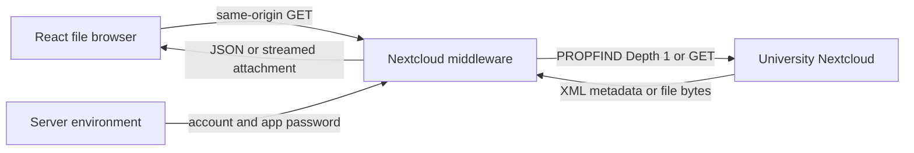

# Technical implementation

## Architecture



The npm project uses ES modules. React mounts in StrictMode. Node supplies HTTP, fetch, filesystem and stream APIs. No database is used.

## Source map

| File | Responsibility |
| --- | --- |
| `src/main.jsx` | React entry point and shared CSS |
| `src/App.jsx` | BrowserRouter and page routes |
| `src/components/Layout.jsx` | Reads folder query, fetches metadata and supplies outlet context |
| `src/hooks/useNextcloudData.js` | JSON fetch, abort handling, loading state and errors |
| `src/pages/DirectoryIndex.jsx` | Breadcrumbs, filename search, cards and empty/error states |
| `src/pages/FileDetails.jsx` | Name, MIME type, size, download and Nextcloud links |
| `src/index.css` | Layout, long-name wrapping and mobile stacking |
| `server/nextcloud.js` | Path validation, WebDAV URLs, XML parsing, API and streaming |
| `server/start.js` | Environment loading and standalone API/static server |
| `vite.config.js` | API middleware for development and preview |
| `tests/nextcloud.test.js` | Node tests with mocked upstream requests |
| `.env.example` | Empty server credential settings |
| `.gitignore` | Excludes environment files, build output and dependencies |
| `eslint.config.js` | Browser/React rules plus Node globals for server, tests and Vite |

## Frontend routes and data flow

| Route | Behavior |
| --- | --- |
| `/` | List the configured root |
| `/?path=Documents` | List the relative Documents folder |
| `/topic/report.pdf?path=Documents` | Details for Documents/report.pdf |
| Other paths | Render the directory via the wildcard route |

Paths and filename parameters are URL-encoded. React Router supplies the decoded filename parameter. File details look up a non-folder entry in the current listing; missing files show a not-found state with a link back.

The hook returns `directory`, `isLoading` and `error`; Layout adds `path` to outlet context. It validates JSON content type and the entries array. Search is case-insensitive and matches names only. Contents are not fetched until download is requested.

## API contract

Both endpoints accept a URL-encoded `path` relative to S.Y. An empty listing path selects the root.

### GET /api/nextcloud/files?path=Documents

The backend sends PROPFIND to `/remote.php/dav/files/{account}/Welcome.Lounge_WiSe2026_27/S.Y/Documents`, requesting resource type, content type and content length.

Illustrative response (not actual folder contents):

```json
{
  "entries": [
    {
      "name": "report.pdf",
      "path": "Documents/report.pdf",
      "isFolder": false,
      "mimeType": "application/pdf",
      "size": 1234
    }
  ],
  "folderUrl": "https://nextcloud.uni-weimar.de/apps/files/files?dir=%2FWelcome.Lounge_WiSe2026_27%2FS.Y"
}
```

The parser normalizes single/multiple response and propstat nodes, uses successful properties, excludes the requested folder itself and non-child entries, then sorts folders first and names next. Missing MIME types become empty strings; unavailable/invalid lengths become zero.

### GET /api/nextcloud/download?path=Documents%2Freport.pdf

The backend GETs the file and pipes its response body through `Readable.fromWeb` and `pipeline`. Content-Disposition contains an encoded filename. The result is an attachment, not an inline preview. If streaming fails after headers are sent, the connection is destroyed instead of writing JSON into the file.

### Errors

Errors are JSON objects containing `error`; some also contain the root `folderUrl`. API responses use no-store.

| Status | Meaning |
| --- | --- |
| 400 | Invalid relative path |
| 404 | Unknown API route or upstream resource missing |
| 405 | API method other than GET |
| 503 | Missing server credentials |
| 502 | Upstream access denial, network/timeout/redirect failure, invalid XML or another upstream error |

## Server modes and limitations

Vite loads NEXTCLOUD_ settings for the selected mode and installs the middleware in development/preview. The standalone server loads `.env.local` from the working directory and serves `dist` relative to its source file. Server environment variables can also provide credentials.

Static serving accepts GET/HEAD, rejects paths outside dist and falls back to index.html for SPA routes or missing assets. Its MIME map covers HTML, JavaScript, CSS, SVG, PNG and ICO; other extensions use octet-stream. API handling precedes static fallback.

There is no visitor authentication, extraction, upload, full-text search, pagination, range support, file watching or credential provisioning. Root-relative API URLs and BrowserRouter assume deployment at the origin root; subpath hosting needs additional configuration. Source-folder constants currently occur in backend and frontend code.
